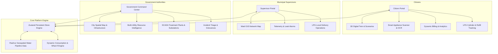

# 🌐 SavEra — AI-Powered Smart Resource Intelligence Platform

[](https://nextjs.org/)
[](https://react.dev/)
[](https://www.typescriptlang.org/)
[](https://tailwindcss.com/)
[](https://threejs.org/)
[](https://leafletjs.com/)
[](https://vitest.dev/)

> **SavEra** is an end-to-end, multi-utility resource intelligence and conservation platform bridging citizens, municipal supervisors, and government administrators. It transforms urban utility management across **Electricity**, **Water**, and **LPG Gas** through real-time GIS mapping, 3D digital twinning, computer vision appliance scanning, predictive demand analytics, and automated SCADA telemetry.

---

## 📑 Table of Contents

- [Key Highlights](#-key-highlights)
- [System Architecture](#-system-architecture)
- [Core Features & Modules](#-core-features--modules)
  - [1. Citizen Portal](#1-citizen-portal)
  - [2. Supervisor & Councillor Portal](#2-supervisor--councillor-portal)
  - [3. Government Command Center](#3-government-command-center)
  - [4. Authentication & Onboarding](#4-authentication--onboarding)
- [Tech Stack](#-tech-stack)
- [Project Structure](#-project-structure)
- [Getting Started](#-getting-started)
- [Running Tests & Quality Assurance](#-running-tests--quality-assurance)
- [Data Model & State Management](#-data-model--state-management)
- [Roadmap & Vision](#-roadmap--vision)
- [License & Authors](#-license--authors)

---

## ⚡ Key Highlights

- 🏢 **Interactive 3D Digital Twin**: Realistic isometric 3D habitat simulator (Three.js / React Three Fiber) with real-time solar irradiation, appliance power consumption mapping, and "What-If" energy efficiency simulation scenarios.
- 🗺️ **GIS Geospatial Pipeline Mapping**: Full geographic pipeline network visualization with Leaflet, connecting reservoirs, primary/secondary feeders, booster pumps, and ward-level pressure/flow telemetry.
- 📷 **Smart Appliance Scanner**: In-browser camera scanner with live barcode/QR detection and OCR spec sheet extraction to dynamically calculate Star Ratings, carbon footprints, and running costs.
- 📊 **Dynamic User-Centric Billing**: Dynamic tier-based tariff calculation (e.g., BESCOM slabs) tied to real-time citizen usage profiles with historical breakdown and peak demand surge warnings.
- 🛢️ **LPG Smart Refill & Demand Prediction**: Machine learning-based burn rate estimation, cylinder safety audits, refill forecasting, and distributor logistics load balancing.
- 🏛️ **Government War Room & Triage**: Integrated municipal multi-utility command dashboard with real-time leak detection, SCADA metrics, supply rationing, and citizen grievance escalation.

---

## 🏗️ System Architecture



---

## 🚀 Core Features & Modules

### 1. Citizen Portal
- **Dashboard (`/citizen`)**: Consolidated overview of daily water consumption, electricity usage, carbon index, and active utility alerts.
- **Dynamic Electricity & Billing (`/citizen/electricity`)**: Slabs-based cost calculator, hourly load curves, solar generation offsets, and personalized energy saving tips.
- **3D Digital Twin (`/citizen/twin`)**:
  - Live interactive 3D house model built with Three.js.
  - Multi-room toggle (Living Room, Kitchen, Bedroom, Bathroom, Rooftop Solar).
  - "What-If" scenario sandbox: Simulates upgrading to 5-star appliances, installing rooftop solar PV, or adopting smart time-of-use tariffs.
- **Smart Scan & OCR (`/citizen/scan`)**:
  - Web camera viewfinder with live targeting reticle.
  - Barcode & QR code scanning powered by `html5-qrcode`.
  - Automated appliance identification, energy star estimation, and annual bill impact projections.
- **Water Management (`/citizen/water`)**: Daily consumption tracking vs. municipal quota, leak detection alerts, and smart meter history.
- **LPG Operations (`/citizen/gas`)**: Real-time cylinder weight / gas level tracker, predictive days-to-empty forecast, booking status tracker, and emergency leak safety checklist.

### 2. Supervisor & Councillor Portal
- **Supervisor Hub (`/supervisor`)**: Operational status of wards, active field technicians, unassigned pipeline leaks, and inventory status.
- **Water GIS Map (`/supervisor/water`)**:
  - Interactive Leaflet map displaying water supply pipelines (Main, Distribution, Household branches).
  - Sensor markers with real-time pressure (bar) and flow rates (L/min).
  - Visual leak localization markers with severity indicators and dispatch action triggers.
- **LPG Distribution Logistics (`/supervisor/gas`)**: Ward-wise cylinder demand forecasting, buffer stock monitoring, and distributor dispatch queues.

### 3. Government Command Center (`/gov`)
- **Spatial GIS Console**: City-wide geographic visualization of pipelines, reservoirs, grid substations, and ward boundaries with heatmaps.
- **Resource Intelligence Tab**: Macro-level consumption trends, peak power grid load, reservoir capacity levels, and municipal LPG consumption indices.
- **SCADA Infrastructure View**: Real-time operational status of major pumping stations, treatment plants, booster pumps, and water quality indices (TDS, pH, Chlorine).
- **Operations & Grievance Triage**: Automated ticketing engine for citizen complaints, outage reports, and technician deployment tracking.

### 4. Authentication & Onboarding (`/auth`)
- **Full Registration & Sign-Up Flow**: Create new citizen, supervisor, or authority accounts.
- **Role Validation**: Enforced authorization guards ensuring strict role-based access control.
- **Auto-Habitat Generation**: Automatically configures household metadata, appliance configurations, and consumption baseline upon registration.
- **One-Click Demo Switcher**: Instant switching between Citizen, Supervisor, and Administrator personas with full state reset capability.

---

## 🛠️ Tech Stack

| Domain | Technology / Library | Purpose |
|---|---|---|
| **Framework** | Next.js 15.5 (App Router) | High-performance React server and client components |
| **Language** | TypeScript 5.9 | Strict type safety across utility data models |
| **Styling** | Tailwind CSS v4 | Ultra-responsive modern dark/light UI design system |
| **3D Rendering** | Three.js & React Three Fiber | Interactive 3D Digital Twin habitat visualization |
| **Geospatial & Maps** | Leaflet & React-Leaflet | GeoJSON pipeline tracing, sensor markers, and GIS layers |
| **Computer Vision** | HTML5-QRCode & Image OCR | Live camera appliance barcode/QR scanning |
| **State Management** | Zustand (v5) | Persistent client-side store with reactive synchronization |
| **Charts & Graphs** | Recharts (v3) | Real-time multi-utility consumption and demand telemetry |
| **UI Components** | Radix UI Primitives | Accessible modals, tabs, sliders, accordions, and dropdowns |
| **Icons & Motion** | Lucide React & Framer Motion | Dynamic icons and fluid micro-animations |
| **Unit & E2E Testing** | Vitest & Playwright | Test coverage across calculation engines and workflows |

---

## 📂 Project Structure

```text
SavEra/
├── public/                 # Static assets, demo scan barcodes, map pins
├── src/
│   ├── app/                # Next.js 15 App Router pages & routes
│   │   ├── auth/           # Login, registration & persona selection
│   │   ├── citizen/        # Citizen portal (twin, scan, electricity, water, gas)
│   │   ├── gov/            # Government / Municipal Authority command center
│   │   └── supervisor/     # Ward councillor & utility supervisor GIS maps
│   ├── components/         # Modular, reusable component library
│   │   ├── features/       # Feature-specific modules (LPG, scanner, billing)
│   │   ├── layout/         # Shell, navigation, role guards & demo controls
│   │   ├── maps/           # Leaflet GIS maps, pipeline renderers, markers
│   │   ├── savera/         # Design system primitives, stat cards, progress rings
│   │   └── twin/           # Three.js 3D isometric house & what-if scenarios
│   ├── data/               # Seed data, geospatial pipelines & catalogue
│   │   ├── catalogue/      # Appliance energy models & LPG seasonality factors
│   │   ├── geo/            # Raichur GIS coordinates & water pipeline polylines
│   │   └── seed/           # Multi-utility seeds, personas, alerts & aggregates
│   ├── lib/                # Utility calculation engines, formatters, CSV handlers
│   │   ├── auth/           # Sign-up helpers and credential validation
│   │   └── engine/         # Tariff calculations, LPG demand & water leak algorithms
│   ├── stores/             # Zustand stores (session, data, lpgOps)
│   └── types/              # Comprehensive TypeScript definitions
├── tests/                  # Test suites (vitest unit tests, Playwright E2E)
└── package.json            # Scripts, metadata, and dependencies
```

---

## 🚦 Getting Started

### Prerequisites
- **Node.js**: `v20.0.0` or higher
- **npm** or **yarn** / **pnpm** / **bun**

### 1. Clone the Repository
```bash
git clone https://github.com/mr-umar-ahmed/SavEra.git
cd SavEra
```

### 2. Install Dependencies
```bash
npm install
```

### 3. Start the Development Server
```bash
npm run dev
```

Open [http://localhost:3000](http://localhost:3000) in your browser to interact with the application.

### 4. Explore Demo Personas
You can explore all role-based experiences immediately using the top bar persona switcher:
- 👤 **Citizen**: `Ramesh Patil` (Household Habitat & 3D Twin)
- 👷 **Supervisor**: `Suresh Joshi` (Ward Water GIS & LPG Operations)
- 🏛️ **Government**: `Dr. Ananya Sharma` (Municipal Command Center)

---

## 🧪 Running Tests & Quality Assurance

SavEra has a comprehensive test suite covering mathematical engines, tariff calculations, demand forecast algorithms, and mock seed validations:

```bash
# Run all unit tests with Vitest (112+ passing tests)
npm test

# Run TypeScript compilation checks
npm run typecheck

# Run ESLint validation
npm run lint

# Format codebase with Prettier
npm run format
```

---

## 📈 Data Model & State Management

SavEra is powered by a robust, multi-layer reactive state architecture:
1. **`session.ts`**: Handles active authentication tokens, user persona profiles, selected wards, and role permissions.
2. **`data.ts`**: Synchronizes real-time household telemetry, appliance states, consumption history, and dynamic billing slabs.
3. **`lpgOps.ts`**: Manages cylinder tracking, delivery cycles, stock buffers, and ward-level distribution metrics.
4. **`waterPipelines.ts`**: High-fidelity GIS network covering Main Feeders, Secondary Lines, and Household Service Connections with integrated flow-sensor states.

---

## 🗺️ Roadmap & Vision

- [x] Citizen Multi-Utility Telemetry (Power, Water, Gas).
- [x] 3D Digital Twin Habitat with Real-time Energy Scenario Simulation.
- [x] In-browser Camera OCR & Barcode/QR Appliance Scanning.
- [x] GIS-driven Water Supply Pipeline Visualization with Live Telemetry.
- [x] Government Command Center with Segregated Spatial, Resource, and Infrastructure Views.
- [ ] Integration with Hardware Smart Meters via MQTT / IoT Gateway.
- [ ] Automated Citizen Grievance WhatsApp / SMS Dispatch System.
- [ ] Decentralized Rooftop Solar Peer-to-Peer Trading Ledger.

---

## 📜 License & Authors

Developed by **Umar Ahmed** and the SavEra Team.  
Distributed under the **MIT License**. See `LICENSE` for more information.

For inquiries, support, or partnerships:
- **GitHub**: [@mr-umar-ahmed](https://github.com/mr-umar-ahmed)
- **Repository**: [https://github.com/mr-umar-ahmed/SavEra](https://github.com/mr-umar-ahmed/SavEra)
